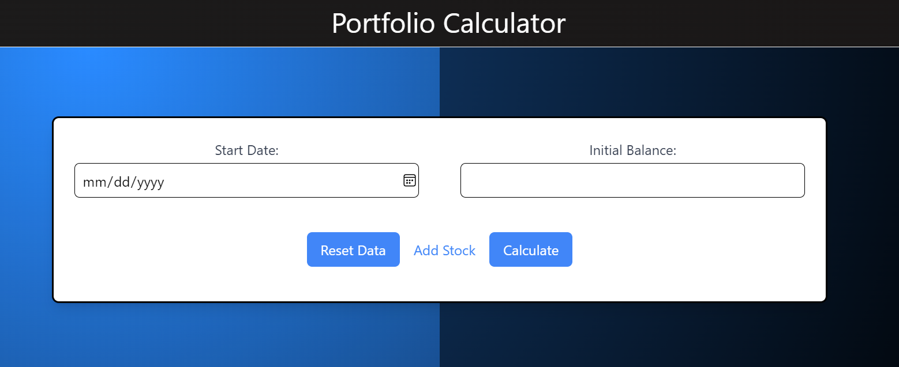
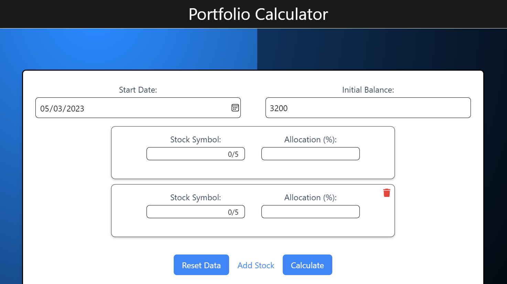

# Portfolio Calculator

This application allows a user to enter the their assets portfolio at some day in the past and see how much money would be worth today, along with the stock value history.

The user first inputs their initial investment at a day. They also proceed to enter the shares and the percentage of the portfolio it takes up. The web application proceeds to calculate the current worth of the portfolio along with graph visualizations of the stock trends till date.

### Example:
Start Date: 2013-03-20

Initial Balance:$32500

Portfolio Allocation: 20% AAPL, 50% GOOG, 30% MSFT

## How to set up TwelveData API key
Generate an API key from [Twelve Data](https://twelvedata.com/)

Create .env file 

Name your variable REACT_APP_API and store the API key 

REACT_APP_API=api_key_here (replace api_key_here with your actual key)

## Images
### Enter Date and Initial Investment:

### Enter Stocks and their percentage:

### Hosted URL: 
https://anahar1.github.io/portfolio-calculator/

### Built with:
React, CSS, Python and Tailwind

### Contributers:
Anish Nahar, David Harianto, Kojiro So, Ceri May

This project was made as a submission in the Lighthall Software Engineering Super League 2 - Level 2.
